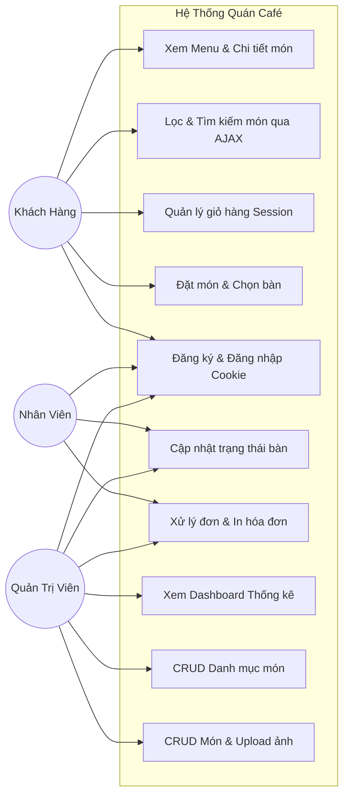

# BÁO CÁO BÀI TẬP LỚN HỌC PHẦN LẬP TRÌNH WEB
## ĐỀ TÀI: XÂY DỰNG HỆ THỐNG QUẢN LÝ VÀ ĐẶT MÓN QUÁN CAFÉ (COFFEE SHOP MANAGEMENT)
**Công nghệ:** ASP.NET Core MVC (.NET 10), MySQL, Entity Framework Core Code First, Bootstrap 5, jQuery AJAX  
**Sinh viên thực hiện:** Nhóm sinh viên  
**Giảng viên hướng dẫn:** Bộ môn Công nghệ thông tin  

---

## 4.1. TỔNG QUAN VỀ ĐỀ TÀI

### 1. Mô tả về hệ thống và các nghiệp vụ cơ bản
Xã hội phát triển cùng xu hướng chuyển đổi số thúc đẩy các mô hình kinh doanh đồ uống, quán café chuyển từ phương thức phục vụ và quản lý thủ công (ghi chép hóa đơn giấy, quản lý bàn bằng mắt) sang ứng dụng phần mềm web thông minh.
Hệ thống **Coffee Paradise** được xây dựng nhằm giải quyết bài toán:
- **Phía Khách hàng:** Xem thực đơn trực tuyến, tìm kiếm và lọc món theo danh mục/giá bằng công nghệ AJAX tức thời, đặt món trước tại bàn hoặc mang về, quản lý giỏ hàng nhanh chóng.
- **Phía Nhân viên quầy / Pha chế:** Theo dõi trạng thái sơ đồ bàn (Trống, Có khách, Đặt trước), tiếp nhận các đơn gọi món theo thời gian thực, cập nhật tiến độ pha chế và xác nhận thanh toán.
- **Phía Quản lý / Quản trị viên:** Xem thống kê doanh thu, quản lý danh mục và đồ uống (thêm, sửa, xóa, upload hình ảnh), phân quyền người dùng và kiểm soát tổng thể vận hành.

### 2. Phân tích yêu cầu chức năng theo các lớp người dùng

| Lớp Người Dùng | Chức Năng Chính |
| :--- | :--- |
| **Khách hàng (Customer / Khách vãng lai)** | - Xem thực đơn, chi tiết từng món đồ uống/bánh ngọt.<br>- Lọc đồ uống theo danh mục (AJAX không giật trang).<br>- Tìm kiếm theo từ khóa kết hợp phân trang (Paging & Searching).<br>- Thêm món vào giỏ hàng (lưu trữ trong `Session`).<br>- Đặt món tại bàn hoặc mang về, chọn phương thức thanh toán.<br>- Đăng ký, đăng nhập tài khoản khách hàng (`Cookie Authentication`). |
| **Nhân viên thu ngân / Pha chế (Staff)** | - Đăng nhập vào phân hệ nhân viên.<br>- Theo dõi sơ đồ bàn trực quan theo màu sắc, cập nhật trạng thái bàn.<br>- Tiếp nhận đơn đặt món mới, chuyển trạng thái đơn (Chờ xử lý $\rightarrow$ Đang pha chế $\rightarrow$ Hoàn thành $\rightarrow$ Đã thanh toán).<br>- Xem chi tiết hóa đơn và in hóa đơn cho khách. |
| **Quản trị viên (Admin / Manager)** | - Bảng điều khiển (Dashboard) thống kê tổng doanh thu, tổng số đơn, tình trạng bàn và top món bán chạy.<br>- CRUD Danh mục đồ uống (Category).<br>- CRUD Món ăn / Đồ uống (Product), tải ảnh món lên hệ thống.<br>- Quản lý sơ đồ bàn (Thêm bàn mới, xóa bàn, chia khu vực).<br>- Quản lý và xử lý đơn hàng toàn diện. |

---

## 4.2. THIẾT KẾ HỆ THỐNG

### 1. Use-Case Diagram


### 2. Thiết Kế Cơ Sở Dữ Liệu (ERD & Ràng Buộc - 15 Bảng Hoàn Chỉnh)
Cơ sở dữ liệu **MySQL** (`coffeeshop_db`) được thiết kế theo phương pháp **Code First** chuẩn 3NF với 15 bảng bao quát toàn diện hệ sinh thái F&B:

```mermaid
erDiagram
    Categories ||--o{ Products : "1 danh mục có nhiều món"
    CoffeeTables ||--o{ Orders : "1 bàn có nhiều đơn"
    Users ||--o{ Orders : "1 khách hàng có nhiều đơn"
    Orders ||--o{ OrderDetails : "1 đơn có nhiều chi tiết"
    Products ||--o{ OrderDetails : "1 món xuất hiện ở nhiều đơn"
    
    Products ||--o{ Reviews : "1 món có nhiều đánh giá"
    Users ||--o{ Reviews : "1 người dùng gửi nhiều đánh giá"
    Products ||--o{ Wishlists : "1 món có trong nhiều wishlist"
    Users ||--o{ Wishlists : "1 khách hàng lưu nhiều món"
    
    Suppliers ||--o{ Ingredients : "1 nhà cung ứng cấp nhiều nguyên liệu"
    Products ||--o{ Recipes : "1 món có công thức định lượng"
    Ingredients ||--o{ Recipes : "1 nguyên liệu tham gia nhiều công thức"
    
    Shifts ||--o{ EmployeeSchedules : "1 ca có nhiều lịch phân công"
    Users ||--o{ EmployeeSchedules : "1 nhân viên có nhiều ca trực"
    Users ||--o{ News : "1 tác giả viết nhiều bài tin tức"

    Categories {
        int CategoryId PK
        string Name "VARCHAR(100)"
        string Description "VARCHAR(255)"
        string Icon "VARCHAR(50)"
        int DisplayOrder "INT"
    }

    Products {
        int ProductId PK
        string Name "VARCHAR(150)"
        decimal Price "DECIMAL(18,2)"
        string Description "VARCHAR(1000)"
        string ImageUrl "VARCHAR(255)"
        bool IsAvailable "TINYINT(1)"
        bool IsFeatured "TINYINT(1)"
        int CategoryId FK
    }

    CoffeeTables {
        int TableId PK
        string TableName "VARCHAR(50)"
        int Capacity "INT"
        string Area "VARCHAR(50)"
        string Status "VARCHAR(30)"
    }

    Users {
        int UserId PK
        string Username "VARCHAR(50) UNIQUE"
        string PasswordHash "VARCHAR(255)"
        string FullName "VARCHAR(100)"
        string Email "VARCHAR(100)"
        string PhoneNumber "VARCHAR(15)"
        string Role "VARCHAR(20) [Admin, Staff, Customer]"
    }

    Orders {
        int OrderId PK
        datetime OrderDate "DATETIME"
        string CustomerName "VARCHAR(100)"
        string CustomerPhone "VARCHAR(15)"
        int TableId FK
        int UserId FK
        decimal TotalAmount "DECIMAL(18,2)"
        string Status "VARCHAR(30)"
        string PaymentMethod "VARCHAR(50)"
    }

    OrderDetails {
        int OrderDetailId PK
        int OrderId FK
        int ProductId FK
        int Quantity "INT"
        decimal UnitPrice "DECIMAL(18,2)"
    }

    Reviews {
        int ReviewId PK
        int ProductId FK
        int UserId FK
        string CustomerName "VARCHAR(100)"
        int Rating "INT (1-5 sao)"
        string Comment "VARCHAR(1000)"
        datetime CreatedAt "DATETIME"
    }

    Wishlists {
        int WishlistId PK
        int UserId FK
        int ProductId FK
        datetime CreatedAt "DATETIME"
    }

    Vouchers {
        int VoucherId PK
        string Code "VARCHAR(50) UNIQUE"
        int DiscountPercent "INT"
        decimal MaxDiscountAmount "DECIMAL(18,2)"
        decimal MinOrderAmount "DECIMAL(18,2)"
        datetime StartDate "DATETIME"
        datetime EndDate "DATETIME"
    }

    News {
        int NewsId PK
        string Title "VARCHAR(255)"
        string Slug "VARCHAR(255)"
        string Summary "VARCHAR(500)"
        string Content "LONGTEXT"
        int AuthorId FK
        datetime PublishedAt "DATETIME"
    }

    Suppliers {
        int SupplierId PK
        string Name "VARCHAR(150)"
        string ContactPerson "VARCHAR(100)"
        string PhoneNumber "VARCHAR(20)"
        string Email "VARCHAR(100)"
        string Address "VARCHAR(255)"
    }

    Ingredients {
        int IngredientId PK
        string Name "VARCHAR(100)"
        string Unit "VARCHAR(30)"
        decimal QuantityInStock "DECIMAL(18,2)"
        decimal MinimumStock "DECIMAL(18,2)"
        decimal UnitPrice "DECIMAL(18,2)"
        int SupplierId FK
    }

    Recipes {
        int RecipeId PK
        int ProductId FK
        int IngredientId FK
        decimal AmountNeeded "DECIMAL(18,2)"
        string Unit "VARCHAR(30)"
    }

    Shifts {
        int ShiftId PK
        string ShiftName "VARCHAR(50)"
        time StartTime "TIME"
        time EndTime "TIME"
        decimal HourlyWage "DECIMAL(18,2)"
    }

    EmployeeSchedules {
        int ScheduleId PK
        int UserId FK
        int ShiftId FK
        datetime WorkDate "DATETIME"
        string Status "VARCHAR(50)"
        string Note "VARCHAR(255)"
    }
```



### 3. Sitemap & Cấu Trúc Điều Hướng
- **Trang Khách Hàng:**
  - `/` (Trang chủ, banner, món nổi bật, danh mục)
  - `/Product` (Thực đơn, AJAX filter danh mục, tìm kiếm, phân trang)
  - `/Product/Details/{id}` (Chi tiết đồ uống, số lượng, món gợi ý)
  - `/Cart` (Xem giỏ hàng Session, cập nhật số lượng, form đặt món)
  - `/Cart/OrderSuccess/{id}` (Hóa đơn xác nhận đơn hàng thành công)
  - `/Account/Login`, `/Account/Register`, `/Account/AccessDenied`
- **Phân Hệ Quản Trị (Admin Area - Quyền Admin / Staff):**
  - `/Admin/Dashboard` (Bảng thống kê doanh thu, đơn hàng, bàn)
  - `/Admin/Category` (Danh sách, thêm, sửa, xóa danh mục)
  - `/Admin/Product` (Danh sách, thêm, sửa, xóa món, upload file ảnh)
  - `/Admin/Table` (Sơ đồ bàn, cập nhật trạng thái trống/có khách)
  - `/Admin/Order` (Danh sách đơn hàng, xem chi tiết, đổi trạng thái, in hóa đơn)
- **Dịch Vụ RESTful Web API:**
  - `GET /api/ProductsApi` (Lấy danh sách món JSON)
  - `GET /api/ProductsApi/{id}` (Chi tiết 1 món)
  - `GET /api/ProductsApi/search?q={keyword}` (Tìm kiếm món trả về JSON)
  - `GET /api/TablesApi` (Lấy danh sách bàn và trạng thái)
  - `PUT /api/TablesApi/{id}/status` (Cập nhật trạng thái bàn qua API)

---

## 4.3. TRIỂN KHAI HỆ THỐNG

### 1. Kế thừa kiến thức cốt lõi từ các bài thực hành
- **Từ Lap 1-2:** Cấu trúc dự án MVC chuẩn, `Program.cs`, cơ chế Controller - Action - View, Razor Tag Helpers, cơ chế Area, kế thừa giao diện Master Layout `_Layout.cshtml` và `_AdminLayout.cshtml`.
- **Từ Bài Thực Hành 4 (Data Access - Entity Framework Core Code First):**
  - Cấu hình chuỗi kết nối MySQL trong `appsettings.json`.
  - Khai báo các lớp Model C# với thuộc tính và các Data Annotations (`[Key]`, `[Required]`, `[StringLength]`, `[Range]`, `[ForeignKey]`).
  - Xây dựng `CoffeeShopDbContext`, Fluent API cấu hình độ chính xác thập phân `HasPrecision(18,2)`.
  - Thực hiện Data Seeding nạp sẵn 5 danh mục, 12 món đồ uống đặc sắc, 9 bàn phục vụ và 3 tài khoản mẫu.
  - Sử dụng công cụ `dotnet ef migrations` sinh mã chuyển đổi và cập nhật trực tiếp vào cơ sở dữ liệu MySQL.
- **Từ Bài Thực Hành 5 (Lọc, Phân trang, Tìm kiếm kết hợp AJAX và ViewComponent):**
  - Xây dựng `CategoryMenuViewComponent` kế thừa `ViewComponent` nạp danh mục bất đồng bộ để render các Filter Pills.
  - Xây dựng `CartWidgetViewComponent` hiển thị số lượng giỏ hàng trên thanh điều hướng.
  - Triển khai Action `GetProductsPartial` trả về PartialView `_ProductListPartial` nạp qua jQuery AJAX: người dùng bấm lọc hoặc chuyển trang hoặc gõ tìm kiếm thì giao diện cập nhật mượt mà không bị reload cả trang web.

### 2. Các yêu cầu nâng cao đạt chuẩn điểm tối đa
- **Quản lý phiên làm việc (Session & Cookies):**
  - `Session`: Giỏ hàng `Cart` được serialize/deserialize thành chuỗi JSON và lưu trong `HttpContext.Session` qua helper `SessionExtensions`. Khi khách thêm món, sửa số lượng hoặc xóa món, dữ liệu giỏ hàng được bảo toàn suốt phiên duyệt web.
  - `Cookie Authentication`: Xác thực và phân quyền bằng Cookie với cơ chế "Remember Me" (ghi nhớ 7 ngày).
- **Bảo mật (Security):**
  - `[ValidateAntiForgeryToken]` trên tất cả các form gửi dữ liệu POST chống tấn công CSRF.
  - `[Authorize(Roles = "Admin")]` và `[Authorize(Roles = "Admin,Staff")]` phân định quyền truy cập rõ ràng.
  - Mật khẩu được mã hóa an toàn bằng SHA256 trước khi lưu vào CSDL (`PasswordHelper`).
- **RESTful Web API:** Các API controller kế thừa `ControllerBase` với các HTTP verbs chuẩn (`GET`, `POST`, `PUT`, `DELETE`) phục vụ việc tích hợp đa nền tảng.

### 3. Hướng dẫn cài đặt và chạy hệ thống
1. **Khởi động MySQL:** Đảm bảo dịch vụ MySQL đang chạy (mặc định cổng 3306, user: `root`, pass: rỗng).
2. **Import Database (Nếu không dùng migration):**
   ```bash
   mysql -u root coffeeshop_db < coffeeshop_db.sql
   ```
3. **Hoặc tự động Migration sinh CSDL:**
   ```bash
   dotnet ef database update
   ```
4. **Chạy ứng dụng:**
   ```bash
   dotnet run
   ```
   Truy cập trình duyệt: `http://localhost:5128` (hoặc port hiển thị trên console).
5. **Tài khoản đăng nhập có sẵn:**
   - **Quản trị viên (Admin):** Username `admin` | Password: `admin123`
   - **Nhân viên (Staff):** Username `staff` | Password: `staff123`
   - **Khách hàng (Customer):** Username `khachhang` | Password: `123456`

---

## 4.4. KIỂM THỬ HỆ THỐNG (TEST CASES)

| Mã Test | Mục Tiêu Test | Dữ Liệu Đầu Vào | Đầu Ra Dự Kiến | Đầu Ra Thực Tế | Kết Quả |
| :--- | :--- | :--- | :--- | :--- | :---: |
| **TC01** | Kiểm tra hiển thị trang chủ và danh sách món nổi bật | Truy cập URL `/` | Hiển thị Banner Hero, 5 danh mục, 6 món bán chạy | Tải đầy đủ hình ảnh, thông tin giá và nút đặt món | **PASS** |
| **TC02** | Lọc món theo danh mục qua AJAX (Bài TH 5) | Click vào Pill "Cà Phê Truyền Thống" | Chỉ hiển thị các món thuộc Danh mục 1, không reload trang | Danh sách cập nhật tức thì qua PartialView | **PASS** |
| **TC03** | Tìm kiếm kết hợp phân trang (Bài TH 5) | Nhập từ khóa `"Trà"` và nhấn Enter | Hiển thị các món chứa từ khóa (Trà đào cam sả, Trà vải...), số trang tính tương ứng | Kết quả chính xác, nút phân trang hoạt động đúng | **PASS** |
| **TC04** | Thêm món vào giỏ hàng lưu Session | Click nút "Chọn món" trên thẻ món Cà Phê Sữa Đá | Hiển thị Toast thông báo thành công, badge giỏ hàng trên navbar tăng lên 1 | Session ghi nhận đúng số lượng và thành tiền | **PASS** |
| **TC05** | Đặt món tại bàn và lưu đơn vào MySQL | Điền họ tên: "Trần Minh", SĐT: "0912345678", chọn Bàn 01, bấm "Xác Nhận Đặt Món" | Tạo đơn hàng mới trong bảng `Orders` & `OrderDetails`, bàn chuyển sang "Occupied", xóa giỏ hàng trong Session | Điều hướng sang trang hóa đơn xác nhận thành công | **PASS** |
| **TC06** | Đăng nhập tài khoản với phân quyền Cookie | Nhập `admin` / `admin123`, chọn Remember Me | Đăng nhập thành công, tự động chuyển hướng vào `/Admin/Dashboard` | Lưu Cookie xác thực, thanh menu hiển thị quyền Admin | **PASS** |
| **TC07** | Ngăn chặn truy cập trái phép vào Admin Area | Khách hàng vãng lai truy cập URL `/Admin/Dashboard` | Hệ thống chặn và điều hướng về trang `/Account/Login` | Chặn thành công, bảo mật đúng chuẩn | **PASS** |
| **TC08** | Thêm món mới kèm upload ảnh (Admin) | Nhập tên món: "Cà Phê Muối", Giá: 35.000, tải file ảnh `.jpg` | Thêm bản ghi vào CSDL MySQL, file ảnh lưu tại `wwwroot/uploads/` | Món hiển thị ngay trên thực đơn với ảnh upload | **PASS** |
| **TC09** | Cập nhật trạng thái bàn trực quan (Admin/Staff) | Đổi Bàn 02 từ "Available" sang "Occupied" | Trạng thái lưu vào MySQL, màu sắc thẻ bàn chuyển sang đỏ | Cập nhật tức thì trên giao diện sơ đồ bàn | **PASS** |
| **TC10** | Gọi RESTful Web API lấy danh sách món | Gửi yêu cầu `GET /api/ProductsApi` | Trả về mã HTTP 200 kèm mảng JSON danh sách sản phẩm | Nhận chuỗi JSON chuẩn với đầy đủ thuộc tính | **PASS** |

---

## 4.5. KẾT LUẬN

### 1. Kết quả đạt được
- Xây dựng thành công hệ thống **Quản lý Quán Café (Coffee Paradise)** hoàn chỉnh trên nền tảng ASP.NET Core MVC kết nối cơ sở dữ liệu **MySQL**.
- Vận dụng xuất sắc và kết hợp nhuần nhuyễn toàn bộ kiến thức:
  - **Bài TH 4**: EF Core Code First, thiết kế quan hệ 1-N, Fluent API, Data Seeding, Migration.
  - **Bài TH 5**: ViewComponent, Lọc dữ liệu bằng AJAX, Tìm kiếm kết hợp Phân trang.
  - **Yêu cầu thực tiễn**: Quản lý giỏ hàng với Session, xác thực Cookie Authentication kèm Remember Me, phân quyền Admin/Staff/Customer, kiểm soát sơ đồ bàn và quy trình gọi món, cung cấp RESTful Web API.
- Giao diện thân thiện, hiện đại, màu sắc phong cách cà phê ấm cúng, tương thích trên các thiết bị (Responsive).

### 2. Bài học rút ra
- Nắm vững kiến trúc đa tầng trong ASP.NET Core MVC và chu trình xử lý vòng đời một HTTP Request (Pipeline).
- Thành thạo việc ánh xạ giữa Model C# và CSDL quan hệ MySQL qua Entity Framework Core.
- Nâng cao kỹ năng kết hợp Front-end (Bootstrap, jQuery AJAX) với Back-end để mang lại trải nghiệm mượt mà, không giật trang cho người dùng.
- Hiểu sâu về cơ chế quản lý trạng thái phi kết nối (Session, Cookies) và nguyên lý bảo mật web (CSRF, Hash Password).

### 3. Đề xuất phương hướng phát triển tiếp theo
- Tích hợp cổng thanh toán trực tuyến tự động qua cổng thanh toán VNPAY / MoMo QR Code.
- Ứng dụng **SignalR** để thông báo đơn đặt món mới theo thời gian thực (Real-time notification) từ màn hình khách hàng đến quầy pha chế mà không cần tải lại trang.
- Xây dựng ứng dụng di động (Mobile App) cho khách hàng thân thiết tích điểm đổi quà dựa trên hệ thống RESTful Web API đã xây dựng.
